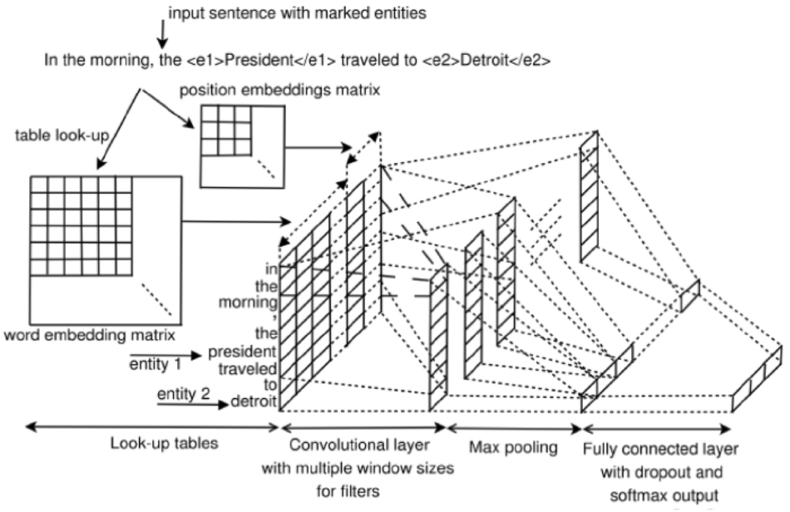
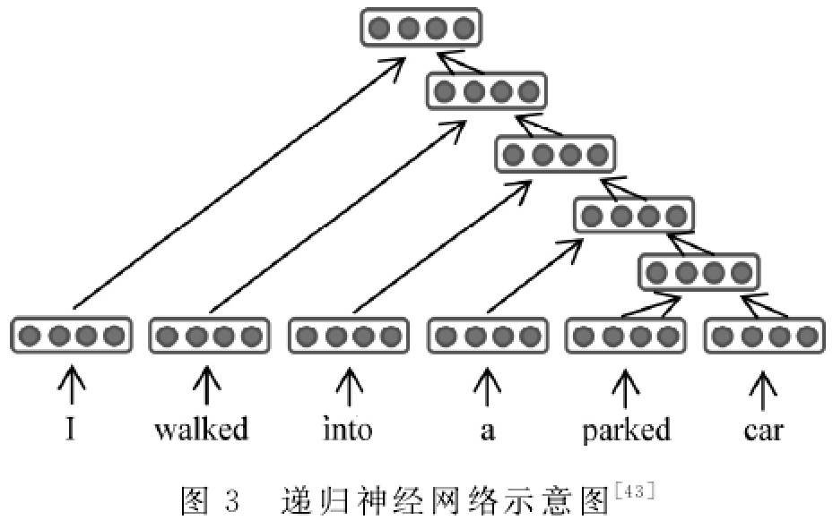
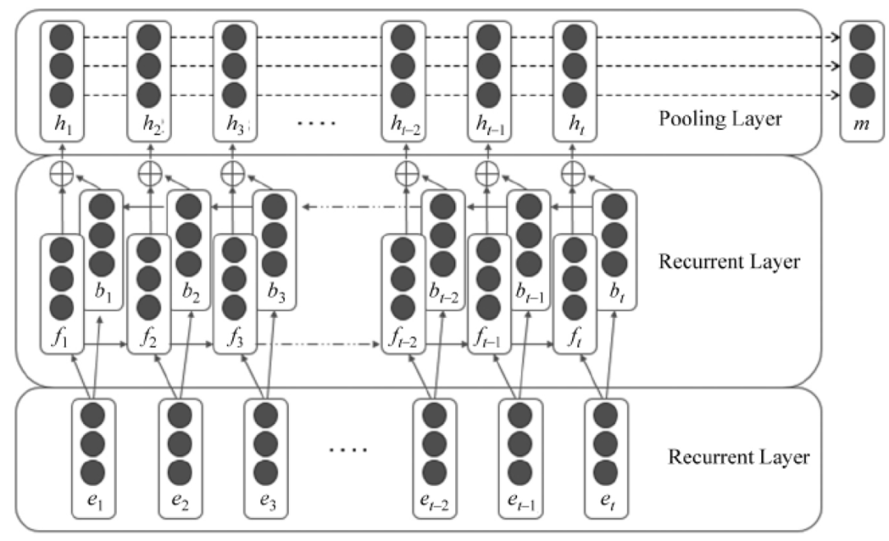

各位NLPer，因实验室要求，马上要入NLP的深坑，所以现在开始看NLP相关的内容，一边查资料一边整理并与大家分享，希望也能帮到你。如果您觉得有用，给个Star吧。 
知乎地址：[**ShuYini**](https://www.zhihu.com/people/wangjini521/activities) 
微信公众号: [**AINLPer**](https://mp.weixin.qq.com/s?__biz=MzUzOTgwNDMzOQ==&mid=100000044&idx=1&sn=0c1a7119492d960383a02a3084589b85&chksm=7ac396f04db41fe69a0d1bac89b34c9c92b37602fe80107b8cf589e8b62288e3c1a83fa074ce&mpshare=1&scene=23&srcid=&sharer_sharetime=1577713726026&sharer_shareid=eacf0e57018e0f1e44bbc3e3d22d8fd2#rd) 

* [一、自然语言生成(NLG)](#自然语言生成)
* [二、自然语言信息抽取(IE)](#自然语言信息抽取) 
&emsp;1、[关系抽取](#关系抽取) 
&emsp;&emsp;1.1[关系抽取分类](#关系抽取分类)  
&emsp;&emsp;&emsp;1.1.1[关系抽取方法分类](#关系抽取方法分类) 
&emsp;&emsp;&emsp;1.1.2[训练数据的标记程度分类 ](#训练数据的标记程度分类 ) 
&emsp;&emsp;&emsp;1.1.3[是否在同一个模型里开展实体抽取和关系分类](#是否在同一个模型里开展实体抽取和关系分类) 
&emsp;&emsp;&emsp;1.1.4[根据机器学习方法分类](#根据机器学习方法分类) 
&emsp;&emsp;1.2[关系抽取深度学习模型](#关系抽取深度学习模型) 
&emsp;&emsp;&emsp;1.2.1[基于递归神经网络的关系抽取](#基于递归神经网络的关系抽取) 
&emsp;&emsp;&emsp;1.2.2[基于循环神经网络的关系抽取](#基于循环神经网络的关系抽取) 
&emsp;&emsp;&emsp;1.2.3[基于卷积神经网络的关系抽取](#基于卷积神经网络的关系抽取) 
&emsp;&emsp;&emsp;1.2.4[基于混合网络模型的关系抽取](#基于混合网络模型的关系抽取) 
&emsp;2、[命名实体抽取](#命名实体抽取) 
&emsp;3、[事件抽取](#事件抽取) 

# 自然语言生成
#### **什么是自然语言生成(NLG)?** 
&ensp;&ensp;&ensp;&ensp;自然语言生成(NLG)是一种语言技术，其主要目的是构建能够“写”的软件系统的技术，即能够用汉语、英语等其他人类语言生成解释、摘要、叙述等。具体来说就是计算机的“编写语言”，它将结构化数据转换为文本，以人类语言表达。即能够根据一些关键信息及其在机器内部的表达形式，经过一个规划过程，来自动生成一段高质量的自然语言文本。NLG用于Email、手机短信，它可以为您自动创建答复；NLG用于图标说明时，可以根据公司数据自动生成图标说明。前段时间在一个有趣的用例中，美联社利用自然语言生成成功的从公司收益报表中生成了报告。这意味着他们不再需要人类消耗他们的时间和精力去解决这些问题。更重要的是，NLG一旦被完美设置就会自动生成数以千计的报告。 

#### **学术研究介绍** 
&ensp;&ensp;&ensp;&ensp;NLG学术界每年都会召开会议，公布NLG的最新发现。这些会议是由[ACL SIGGEN](https://aclweb.org/aclwiki/SIGGEN)组织的，你可以查看其web页面以获取关于即将举行的活动的信息。在这些活动中提交的论文可以通过[ACL Anthology](https://www.aclweb.org/anthology/)在线获得。NLG的商业兴趣日益增长，其中大部分集中在数据到文本，即结合NLG和数据分析的系统，以产生摘要，解释等结构化数据. 

&ensp;&ensp;&ensp;&ensp; **[「自然语言处理（NLP）」你必须要知道的八个国际顶级会议！](https://mp.weixin.qq.com/s?__biz=MzUzOTgwNDMzOQ==&mid=2247484203&idx=1&sn=3a7d89ff46816177c54cc5313ac95d91&chksm=fac394f7cdb41de1b0e371a2c6eb53a57262f5c2dfdafd42d6997c7c2afdfbd816343a7a5fd2&mpshare=1&scene=23&srcid=&sharer_sharetime=1577695086044&sharer_shareid=eacf0e57018e0f1e44bbc3e3d22d8fd2#rd)** 国际学术会议是一种学术影响度较高的会议，它具有国际性、权威性、高知识性、高互动性等特点，其参会者一般为科学家、学者、教师等。具有高学历的研究人员把它作为一种科研学术的交流方式，够为科研成果的发表和对科研学术论文的研讨提供一种途径 ；同时也能促进科研学术理论水平的提高。针对自然语言处理方向比较重要的几个会议有：ACL、EMNLP、NACAL、CoNLL、COLING、ICLR、AAAI、NLPCC等。ACL、EMNLP、NAACL 和 COLING 可以说是 NLP 领域的四大顶会。其中 ACL、EMNLP、NAACL都是一家（均由 ACL）举办。ACL 、AAAI是 CCF 推荐A类国际学术会议，EMNLP 和 COLING 是B类，NAACL 、CoNLL、NLPCC则是C类。

&ensp;&ensp;&ensp;&ensp; **[「自然语言处理（NLP）」2020年八大顶会信息整理（收藏）！！](https://mp.weixin.qq.com/s/Nly7pySMPX7uTp8-1G75KA)**  针对自然语言处理（NLP）方向比较著名的几个会议有：ACL、EMNLP、NACAL、CoNLL、IJCNLP、CoNLL、IJCNLP、COLING、ICLR、AAAI、NLPCC等，下面收集了各个会议在2020年的举办时间、地点以及投稿截止时间，供大家参考。

&ensp;&ensp;&ensp;&ensp; **[「自然语言处理NLP（NLU+NLG）」全球研究组织大汇总！](https://github.com/yinizhilian/NLP_Share/blob/master/%E7%9B%98%E7%82%B9--%E5%85%A8%E7%90%83NLP%E7%A0%94%E7%A9%B6%E6%9C%BA%E6%9E%84.md)** 该资料主要盘点了全球（中国（香港、台湾）、北美、欧洲、亚洲其它国家）所有的研究NLP方向的组织。其中国内比较著名的有腾讯AI Lab、华为诺亚方舟实验室、微软亚洲研究院、哈工大机器智能与翻译研究室、复旦大学自然语言处理研究组等，北美最有名的要数The Stanford Natural Language Processing Group ，CS224N的课程就出自这里。
    
## 资料分享
### 国内外知名大佬博客
#### **Christopher Manning** 
&ensp;&ensp;&ensp;&ensp;[Christopher Manning](https://nlp.stanford.edu/manning/)是斯坦福大学(Stanford University)计算机科学和语言学系教授，同时也是斯坦福大学人工智能实验室(SAIL)主任。他的研究目标是能够智能处理、理解和生成人类语言材料的计算机。Manning是将深度学习应用于自然语言处理领域的领军人物，在树递归神经网络、[词向量手套模型](https://nlp.stanford.edu/pubs/glove.pdf)、情绪分析、神经网络依赖分析、神经机器翻译、问题回答、深度语言理解等领域都有著名的研究成果。他还专注于分析、自然语言推理和多语言语言处理的计算语言学方法，包括斯坦福依赖关系和通用依赖关系的主要开发者。Manning与人合著了关于自然语言处理统计方法(NLP) (Manning and Schutze 1999)和信息检索(Manning, Raghavan, and Schutze, 2008)的领先教材，以及关于ergativity和complex谓词的语言学专著。他是ACM研究员，AAAI研究员，ACL研究员，前ACL主席(2015)。他的研究曾获得ACL、Coling、EMNLP和CHI最佳论文奖。1994年，他在澳大利亚国立大学(Australian National University)获得学士学位，在斯坦福大学(Stanford)获得博士学位。在回到斯坦福大学之前，他曾在卡内基梅隆大学(Carnegie Mellon University)和悉尼大学(University of Sydney)担任教职。他是斯坦福NLP集团的创始人，负责斯坦福CoreNLP软件的开发。

#### **Richard Socher**
&ensp;&ensp;&ensp;&ensp;[Richard Socher](https://www.socher.org/index.php/Main/HomePage)是Salesforce的首席科学家，带领团队从事基础研究(深度学习、自然语言处理、计算机视觉、演讲和推荐)、应用研究、产品孵化和构建跨产品AI平台。在此之前，他是斯坦福大学计算机科学系的兼职教授，也是2016年被Salesforce收购的MetaMind的创始人兼CEO/CTO。2014年，获得了斯坦福大学计算机科学系的博士学位。

#### **Ehud Reiter** 
&ensp;&ensp;&ensp;&ensp;Ehud Reiter是阿伯丁大学的计算机科学教授，同时也是Arria NLG的首席科学家，主要专注于自然语言生成(NLG)技术，即利用人工智能和自然语言处理技术，将非语言数据自动生成高质量文本和叙述文章。他的博客[Ehud Reiter's Blog](https://ehudreiter.com/blog-index/)主要包括：NLG系统的搭建、NLG系统性能的评估、NLG的学术生活、NLG相关话题、个人生活等五个部分，该博客对NLG技术、评价与应用进行了深入的探讨与反思。其中有一篇文章我觉得写得特别不错‘How do I Learn about NLG?’，主要讲了自己学习NLG的一些方法及感悟，感兴趣的同学可以拜读一下。 

#### **Andrej Karpathy**
&ensp;&ensp;&ensp;&ensp;Andrej Karpathy是计算机视觉和深度学习领域的专家之一，毕业于斯坦福人工智能实验室，博士师从李飞飞教授，在谷歌大脑、DeepMind 实过习，与吴恩达一起共事，业界几大深度学习实验室都待过。他经常会在个人[twitter]()上以及[个人博客](http://karpathy.github.io/)上面分享一些关于深度学习相关想法和见解，比如前段时间他分享的[深度学习训练技巧](http://karpathy.github.io/2019/04/25/recipe/)受到了很多人的关注。看过他博客的个人介绍，可以发现，他在2011年到2015年学习期间，主要研究的方向是自然语言处理，它的一篇文章：[神奇的递归神经网络(RNN)](http://karpathy.github.io/2015/05/21/rnn-effectiveness/)是一篇相当不错的入门资料。并且还共享[文本生成](https://github.com/karpathy/char-rnn)的代码。

#### **万小军** 
&ensp;&ensp;&ensp;&ensp;[万小军](https://wanxiaojun.github.io/)是北京大学王选计算机研究所研究员，主要研究领域有自然语言处理，文本挖掘，人工智能。它是语言计算与互联网挖掘研究室（从属北京大学王选计算机科学技术研究所）的负责人。该研究室以自然语言处理技术、数据挖掘技术与机器学习技术为基础，对互联网上多源异质的文本大数据进行智能分析与深度挖掘，为互联网搜索、舆情与情报分析、写稿与对话机器人等系统提供关键技术支撑，并从事计算机科学与人文社会科学的交叉科学研究。 研究室当前研究内容包括：1）语义理解：研制全新的语义分析系统实现对人类语言（尤其是汉语）的深层语义理解；2）机器写作：综合利用自动文摘与自然语言生成等技术让机器写出高质量的各类稿件；3）情感计算：针对多语言互联网文本实现高精度情感、立场与幽默分析；4）其他：兴趣技术探索。 

### 干货学习资源
#### [文本生成资源大列表](https://github.com/ChenChengKuan/awesome-text-generation)
&ensp;&ensp;&ensp;&ensp;该资源主要整理列举了2018年EMNLP的优秀文本生成模型及应用案例（主要以Paper的形式给出）。其中主要包括：模型（GAN based、VAE based、Autoencoder based、Reinforcement learning based、Alternative decode objective、Tool and others）、应用（基于文本的强化学习、基于GAN的对抗学习等）。 

#### [自然语言处理NLP研究进展跟踪](https://github.com/sebastianruder/NLP-progress)
&ensp;&ensp;&ensp;&ensp;该资料是GitHub上的仓库，其主要旨在跟踪自然语言处理(NLP)的进展，并概述最常见的NLP任务及其相应的数据集的最新进展(SOTA)。它的目标包括传统的和核心的NLP任务，如依赖解析和词性标记，以及更近期的一些任务，如阅读理解和自然语言推理。主要目的是为读者提供基准数据集的快速概览和他们感兴趣的任务的最新技术，这是进一步研究的垫脚石。为此，如果某项任务的结果已经发布并定期维护，比如公共排行榜，读者将被指向那里。 

#### 文本生成必读的几篇文章
&ensp;&ensp;&ensp;&ensp;1、[（GitHub）Character based Recurrent Neural Network(内含源码)](https://github.com/karpathy/char-rnn) 
&ensp;&ensp;&ensp;&ensp;该篇文章主要讲述了最基本的Char-RNN文本生成原理，具体如下图所示。以要让模型学习写出“hello”为例，Char-RNN的输入输出层都是以字符为单位。输入“h”，应该输出“e”；输入“e”，则应该输出后续的“l”。输入层我们可以用只有一个元素为1的向量来编码不同的字符，例如，h被编码为“1000”、“e”被编码为“0100”，而“l”被编码为“0010”。使用RNN的学习目标是，可以让生成的下一个字符尽量与训练样本里的目标输出一致。在图一的例子中，根据前两个字符产生的状态和第三个输入“l”预测出的下一个字符的向量为<0.1, 0.5, 1.9, -1.1>，最大的一维是第三维，对应的字符则为“0010”，正好是“l”。这就是一个正确的预测。但从第一个“h”得到的输出向量是第四维最大，对应的并不是“e”，这样就产生代价。学习的过程就是不断降低这个代价。学习到的模型，对任何输入字符可以很好地不断预测下一个字符，如此一来就能生成句子或段落。 
&ensp;&ensp;&ensp;&ensp;&ensp;&ensp;&ensp;&ensp;&ensp;&ensp;&ensp;&ensp;&ensp;&ensp;&ensp;&ensp;&ensp;&ensp;&ensp;&ensp;&ensp;&ensp;&ensp;&ensp;&ensp;&ensp;&ensp;&ensp;&ensp;&ensp;&ensp;&ensp;&ensp;&ensp;&ensp;&ensp;&ensp;&ensp;&ensp;&ensp; 

&ensp;&ensp;&ensp;&ensp;2、[（ACL2015）深度学习生成对话（诺亚方舟实验室--华为）](https://arxiv.org/pdf/1503.02364.pdf) 
&ensp;&ensp;&ensp;&ensp;这篇文章尝试用encoder-decoder（编码-解码）的框架解决短文本对话（Short Text Conversation，缩写为STC）的问题。虽然encoder-decoder框架已经被成功应用在机器翻译的任务中，但是对话与翻译不同，对应一个输入文本（post）往往有多种不同的应答（responses）。文中举了一个例子，一个人说“刚刚我吃了一个吞拿鱼三明治”，不同的应答可以是“天哪，才早晨11点”、“看起来很美味哟”或是“在哪里吃的”。这种一对多的情况在对话中很普遍也很自然。的确，不同的人会对同一句话做出不同的反应，即使是同一个人，如果每次回答都一模一样也是很无趣的。
详细中文解读可见：https://www.cnblogs.com/DjangoBlog/p/7270445.html 

&ensp;&ensp;&ensp;&ensp;3、[（CONLL2016）谷歌人工智能写诗](https://arxiv.org/pdf/1511.06349.pdf) 
&ensp;&ensp;&ensp;&ensp;该篇文章的作者分别来自斯坦福大学、马萨诸塞大学阿姆斯特分校以及谷歌大脑部门，其主要工作是在谷歌完成的。这篇文章的想法非常有意思，他们想使用VAE（varationalautoencoder的简称）学习到一个更连续的句子空间。下图所示，作者使用了单层的LSTM 模型作为encoder（编码器）和decoder（解码器），并使用高斯先验作为regularizer（正规化项），形成一个序列的自动编码器。比起一般的编码解码框架得到的句子编码往往只会记住一些孤立的点，VAE框架学到的可以想象成是一个椭圆形区域，这样可以更好地充满整个空间。我的理解是，VAE框架将贝叶斯理论与深度神经网络相结合，在优化生成下一个词的目标的同时，也优化了跟先验有关的一些目标（例如KL cost和crossentropy两项，细节请参考论文），使对一个整句的表达更好。 

#### 自然语言生成（NLG）论文整理
&ensp;&ensp;&ensp;&ensp;1、[（NAACL2018）A Deep Ensemble Model with Slot Alignment for Sequence-to-Sequence Natural Language Generation](https://arxiv.org/pdf/1805.06553.pdf) 
&ensp;&ensp;&ensp;&ensp;自然语言生成是生成对话系统和会话代理的核心。 本文首先描述了一个集成的神经语言生成器，并提出了几种新的数据表示和扩充方法，在我们的模型中产生了比较好的结果。 我们在餐厅，电视和笔记本电脑领域的三个数据集上测试模型，并报告我们最佳模型的客观和主观评估。 使用一系列自动度量标准以及人工评估器，我们表明我们的方法比相同数据集上的最新模型获得更好的结果。本文的工作主要建立在成功的注意力+编解码器框架的基础上，用于序列到序列学习并通过集成扩展它。 我们探索了一个独立于域的slot aligner的可行性，它可以应用于任何数据集，无论其大小如何，并且reranking task之外。 我们还解决了由于去词语化而导致的一些挑战，以提高表面实现的质量，同时保留神经模型的生成能力。 

&ensp;&ensp;&ensp;&ensp;2、[(AAAI 2017)SeqGAN: Sequence Generative Adversarial Nets with Policy Gradient](https://arxiv.org/pdf/1609.05473.pdf) 
 &ensp;&ensp;&ensp;&ensp;作为一种新的生成模型训练方法，利用判别模型指导生成模型训练的生成对抗网(GAN)在生成实值数据方面取得了很大的成功。但是，当目标是生成离散标记序列时，它有局限性。一个主要原因是生成模型的离散输出使得梯度更新难以从判别模型传递到生成模型。此外，判别模型只能对一个完整的序列进行评价，而对于一个部分生成的序列，一旦生成了整个序列，平衡它当前的分数和未来的分数是不容易的。在本文中，我们提出了一个序列生成框架，称为SeqGAN来解决这些问题。SeqGAN在RL中将数据生成器建模为随机策略，通过直接执行梯度策略更新来绕过生成器的微分问题。RL奖励信号来自于根据完整序列判断的GAN鉴别器，并通过蒙特卡罗搜索返回到中间状态-动作步骤。对合成数据和实际任务的大量实验表明，在强基线上有显著的改进。 
 
&ensp;&ensp;&ensp;&ensp;3、[（ICML 2016）Generative Adversarial Text to Image Synthesis](https://arxiv.org/pdf/1605.05396.pdf) 
&ensp;&ensp;&ensp;&ensp;这篇文章的内容是利用GAN来做根据句子合成图像的任务。在之前的GAN文章，都是利用类标签作为条件去合成图像，这篇文章首次提出利用GAN来实现根据句子描述合成图像。根据句子描述合成图像的任务与其反过程相比（Image caption：给定一张图像，自动生成一句话来描述这张图），Image caption可以转化为根据图片内容和前面的词去预测下一个词，但是对于合成图像，可能有很多种像素的排列都能够表现出当前描述的内容，所以比较困难。要解决句子描述问题，要从两个子问题入手：一是学习好的文本表示，让模型能够准确地捕捉到文本描述信息；二是合成比较真实的图像。 

&ensp;&ensp;&ensp;&ensp;4、**中文诗歌生成【微信AI团队】**[（ACL 2019）Rhetorically Controlled Encoder-Decoder for Modern Chinese Poetry Generation,](https://www.aclweb.org/anthology/P19-1192) 
&ensp;&ensp;&ensp;&ensp;为了将修辞学应用到中文汉语诗歌的生成上，本文提出了一种用于现代汉语诗歌生成的修辞控制编码器。我们的模型依赖于一个连续的潜在变量修辞控制器在编码器中捕获各种修辞模式，然后结合基于修辞的混合物，生成现代汉语诗歌。在隐喻、人格化、自动化的评估方面，我们的模型相比于最先进的基线具有很大的优势，并且人工评估显示，我们的模型生成的诗歌在流畅性、连贯性、意义和修辞美学方面都优于基本方法。 
中文解读可见：https://blog.csdn.net/yinizhilianlove/article/details/100054495 

&ensp;&ensp;&ensp;&ensp;5、**会话响应生成【美国卡耐基梅隆大学】**[（ACL 2019）Boosting Dialog Response Generation)](https://www.aclweb.org/anthology/P19-1005) 
&ensp;&ensp;&ensp;&ensp;神经模型已成为对话响应生成的重要方法之一。然而，它们始终倾向于在语料库中生成最常见和通用的响应。针对这一问题，我们设计了一种基于boost的迭代训练过程和集成方法。该方法以不同的训练和解码范式为基础，包括基于互信息的解码和基于奖励增强的最大似然学习。实证结果表明，本文方法可以显著提高所有基本模型所产生的响应的多样性和相关性，并得到客观测量和人类评价的支持。 
中文解读可见：https://blog.csdn.net/yinizhilianlove/article/details/100054452 

&ensp;&ensp;&ensp;&ensp;6、**电子邮件主题生成【美国耶鲁大学】**[（ACL 2019）This Email Could Save Your Life: Introducing the Task of Email Subject Line Generation.)](https://www.aclweb.org/anthology/P19-1043) 
&ensp;&ensp;&ensp;&ensp;提出并研究了电子邮件主题行生成任务:从电子邮件正文中自动生成电子邮件主题行。我们为这个任务创建了第一个数据集，并发现电子邮件主题行生成非常抽象，这与新闻标题生成或新闻单个文档摘要不同。然后，我们开发了一种新的深度学习方法，并将其与几种基线以及最新的最先进的文本摘要系统进行了比较。我们还研究了几种基于人类判断相关性的自动评价指标的有效性，并提出了一种新的自动评价指标。 
中文解读可见：https://blog.csdn.net/yinizhilianlove/article/details/100054826 

&ensp;&ensp;&ensp;&ensp;7、**基于知识库的感知对话生成【腾讯AI Lab】**[（ACL 2019）Improving Knowledge-aware Dialogue Generation via Knowledge Base Question Answering](https://arxiv.org/pdf/1912.07491v1.pdf) 
&ensp;&ensp;&ensp;&ensp;本文的主要贡献有：1、提出了一种新的知识感知对话生成模型TransDG，该模型将知识库中的问题理解能力和事实提取能力转化为后理解能力和知识库中的事实知识选择能力。2、提出了一种多步译码策略，该策略能够捕捉到信息与响应之间的信息连接。第一步解码器产生的post和draft响应都与KB中的相关事实相匹配，使得第二步解码器产生的最终响应相对于post更合适、更合理。3、提出了一种响应引导注意机制，利用k-最佳响应候选项引导模型关注相关特征。4、在真实对话数据集上的大量实验表明，我们的模型在定量和定性两方面都优于比较方法。 
中文解读可见：https://zhuanlan.zhihu.com/p/99203505 

&ensp;&ensp;&ensp;&ensp;8、**序列到序列自然语言生成（含源码）【微软亚洲研究院】**[（ICML 2019）MASS: Masked Sequence to Sequence Pre-training](https://arxiv.org/pdf/1905.02450.pdf) 
&ensp;&ensp;&ensp;&ensp;微软亚洲研究院的研究员在ICML 2019上提出了一个全新的通用预训练方法MASS，在序列到序列的自然语言生成任务中全面超越BERT和GPT。BERT通常只训练一个编码器用于自然语言理解，而GPT的语言模型通常是训练一个解码器。如果要将BERT或者GPT用于序列到序列的自然语言生成任务，通常只有分开预训练编码器和解码器，因此编码器-注意力-解码器结构没有被联合训练，注意力机制也不会被预训练，而解码器对编码器的注意力机制在这类任务中非常重要，因此BERT和GPT在这类任务中只能达到次优效果。源码地址：https://github.com/microsoft/MASS 
中文解读可见：https://zhuanlan.zhihu.com/p/65346812 

&ensp;&ensp;&ensp;&ensp;9、**文摘生成【国防科大&微软亚洲研究院】**[（CoNLL 2019）Pretraining-Based Natural Language Generation for Text Summarization](https://arxiv.org/pdf/1902.09243.pdf) 
&ensp;&ensp;&ensp;&ensp;本文提出了一种新的基于预训练的编码-解码器框架，该框架可以根据输入序列以两阶段的方式生成输出序列。对于我们模型的编码器，我们使用BERT将输入序列编码到上下文表示中。对于解码器，在我们的模型中有两个阶段，在第一个阶段，我们使用一个基于变压器的解码器来产生一个草稿输出序列。在第二阶段，我们对草稿序列中的每个单词进行掩码并将其提供给BERT，然后结合输入序列和BERT生成的草稿表示，我们使用一个基于转换的解码器来预测每个掩码位置的细化单词。据我们所知，我们的方法是第一个将BERT应用于文本生成任务的方法。作为这一方向的第一步，我们评估了我们提出的方法对文本摘要任务。 
中文解读可见：https://www.cnblogs.com/lauspectrum/p/10961112.html 

&ensp;&ensp;&ensp;&ensp;10、**UniLM(NLU+NLG) 统一预训练模型【微软研究院】**[（NeurIPS 2019）Unified Language Model Pre-training for Natural Language Understanding and Generation](https://arxiv.org/abs/1905.03197) 
&ensp;&ensp;&ensp;&ensp;论文提出了一种新型的统一的预训练语言模型（UniLM），它既可以针对自然语言理解任务进行微调，也能用于自然语言生成任务。这个模型使用了三种类型的语言建模任务进行预训练：单向模型、双向模型、序列到序列预测模型。其统一建模的实现使用了共享的 Transformer 网络，并且还使用了特定的自注意掩码来控制预测条件所处的上下文。在 GLUE 基准以及 SQuAD 2.0 和 CoQA 问答任务上，UniLM 优于 BERT。此外，UniLM 在五个自然语言生成数据集上成为了新的当前最佳，包括将 CNN/DailyMail 抽象式摘要 ROUGE-L 结果提升至 40.51（2.04 的绝对改善）、将 Gigaword 抽象式摘要 ROUGE-L 结果提升至 35.75（0.86 的绝对改善）、将 CoQA 生成式问答 F1 分数提升至 82.5（37.1 的绝对改善）、将 SQuAD 问题生成 BLEU-4 结果提升至 22.12（3.75 的绝对改善）、将 DSTC7 基于文档的对话响应生成 NIST-4 结果提升至 2.67（人类表现为 2.65）。源码地址：https://github.com/microsoft/unilm  
中文解读可见：[统一预训练模型（NLG+NLU）](https://mp.weixin.qq.com/s?__biz=MzUzOTgwNDMzOQ==&mid=2247484235&idx=1&sn=77c23d297f0731d2b737f00fdf21d4ac&chksm=fac39497cdb41d81e0081a5b8974f889ec5b44e43b47a058a89da6d223392f52f6b3f18a6eb9&mpshare=1&scene=23&srcid=&sharer_sharetime=1577802736778&sharer_shareid=eacf0e57018e0f1e44bbc3e3d22d8fd2#rd) 

&ensp;&ensp;&ensp;&ensp;11、**生成语言自然度评估【美国斯坦福】**[(NAACL 2019)Unifying Human and Statistical Evaluation for Natural Language Generation 
](https://arxiv.org/pdf/1904.02792.pdf) 
&ensp;&ensp;&ensp;&ensp;我们该如何度量自然语言生成系统是否生成高质量和多样性的输出？人类评估可以捕捉质量，但是不能衡量多样性，因为这种方法不能分辨生成结果是不是简单地抄袭自训练集。但同时，基于统计的度量方法（即困惑度）能很好地捕捉多样性，但不能严格地度量质量，因为偶尔生成的低质量样本并不能得到充分的惩罚。在这篇论文中，我们提出了一个统一的框架以同时评估生成质量与多样性，它主要通过预测一句话到底是机器生成语言还是人类语言，从而给出预测的最优误差率。我们表示，该误差率能通过结合人类和统计评估高效地估计，我们将使用的评估度量称之为 HUSE。 
源码地址：https://github.com/hughbzhang/HUSE  
中文解读可见：https://zhuanlan.zhihu.com/p/63010816 

&ensp;&ensp;&ensp;&ensp;12、**文本内容生成控制【salesforce】**[(NAACL 2019)CTRL: A CONDITIONAL TRANSFORMER LANGUAGE MODEL FOR CONTROLLABLE GENERATION 
](https://arxiv.org/abs/1909.05858) 
&ensp;&ensp;&ensp;&ensp;大规模的语言模型显示了很有前途的文本生成功能，但是用户不能轻松地控制生成文本的特定方面。我们发布了CTRL，一个16.3亿个参数的条件转换语言模型，用来训练控制代码来控制风格、内容和特定任务的行为。控制代码源于与原始文本自然共存的结构，保留了无监督学习的优点，同时对文本生成提供了更明确的控制。这些代码还允许使用CTRL来预测训练数据的哪些部分最有可能是给定的序列。这为通过基于模型的源属性分析大量数据提供了一种潜在的方法。 
源码地址：https://github.com/salesforce/ctrl  
中文介绍链接：https://mp.weixin.qq.com/s/gdwJkc6eD0oCob4A0UCyZQ

&ensp;&ensp;&ensp;&ensp;13、**数据到文本生成【爱丁堡大学】**[(ACL 2019)Data-to-text Generation with Entity Modeling
](https://www.aclweb.org/anthology/P19-1195.pdf) 
&ensp;&ensp;&ensp;&ensp;提出了**一个以实体为中心的神经网络架构来生成数据到文本**。本文模型创建了动态更新的特定实体表示。文本是在数据输入和实体内存表示的条件下生成的，在每个时间步使用分层注意。我们在RotoWire基准上进行了实验，并在自建的棒球域上新数据集（五倍大）。结果表明，该模型在自动评价和人工评价两方面均优于的基线。 
中文介绍链接：https://zhuanlan.zhihu.com/p/102204688 

&ensp;&ensp;&ensp;&ensp;14、**跨域文本连贯生成神经网络模型【Borealis AI】**[(ACL 2019)A Cross-Domain Transferable Neural Coherence Model](https://www.aclweb.org/anthology/P19-1067.pdf) 
&ensp;&ensp;&ensp;&ensp;**连贯性是文本质量评估的一个重要方面**，也是保证其可读性的关键。现有连贯性模型的一个重要限制是，在一个域上进行训练不会轻易地推广到其他领域的文本类别。先前的工作主张跨域泛化的生成模型，因为判别模型，训练过程中要区分的不连贯句子顺序的空间过大。在这项工作中，我们**提出了一个具有较小负采样空间的局部判别神经模型，该模型可以有效地学习错误的排序，且该模型结构简单，**并在华尔街的标准基准数据集上明显优于以前的最新方法期刊语料库，以及在转移到Wikipedia文章上看不见的论述类别的多个新的挑战性环境中。 

# 自然语言信息抽取
## 信息抽取介绍
&ensp;&ensp;&ensp;&ensp;信息抽取（information extraction），简称IE，即从自然语言文本中，抽取出特定的事件或事实信息，帮助我们将海量内容自动分类、提取和重构。这些信息通常包括实体（entity）、关系（relation）、事件（event）。例如从新闻中抽取时间、地点、关键人物，或者从技术文档中抽取产品名称、开发时间、性能指标等。能从自然语言中抽取用户感兴趣的事实信息，无论是在知识图谱、信息检索、问答系统还是在情感分析、文本挖掘中，信息抽取都有广泛应用。 
&ensp;&ensp;&ensp;&ensp;信息抽取主要包括三个子任务： 
&ensp;&ensp;&ensp;&ensp;[关系抽取](#关系抽取)：通常我们说的三元组(triple)抽取，主要用于抽取实体间的关系。 
&ensp;&ensp;&ensp;&ensp;[实体抽取](#实体抽取)：也就是命名实体识别。 
&ensp;&ensp;&ensp;&ensp;[事件抽取](#事件抽取)：相当于一种多元关系的抽取。 

### 关系抽取
&ensp;&ensp;&ensp;&ensp;关系抽取（RE）是为了抽取文本中包含的关系，是信息抽取（IE）的重要组成部分。主要负责从无结构文本中识别出实体，并抽取实体之间的语义关系，被广泛用在信息检索、问答系统中。 

### 关系抽取分类

#### 关系抽取方法分类

*  基于模式匹配的方法        
*  基于词典驱动的方法 
*  基于机器学习的方法 
*  基于本体的方法 
*  基于混合的方法 
&emsp;基于模式匹配和词典驱动的方法依靠人工制定规则，耗时耗力，而且可移植性较差，基于本体的方法构造比较复杂，理论尚不成熟。基于机器学习的方法以自然语言处理技术为基础，结合统计语言模型进行关系抽取，方法相对简单，并具有不错的性能，成为当下关系抽取的主流方法。 

#### 训练数据的标记程度分类 
*  **有监督**：监督学习的关系集合通常是确定的，仅需要将其当作一个简单的分类问题来处理即可。高质量监督数据下的监督学习模型的准确率会很高，但缺点就是需要大量的人力成本和时间成本来对文本数据进行标注，且其难以扩展新的关系类别，模型较为脆弱，泛化能力有限。        
*  **半监督**：利用少量的标注信息作为种子模版，从非结构化数据中抽取大量的新的实例来构成新的训练数据。主要方法包括 Bootstraping 以及远程监督学习的方法。 
*  **无监督**：利用语料中存在的大量冗余信息做聚类，在聚类结果的基础上给定关系，但由于聚类方法本身就存在难以描述关系和低频实例召回率低的问题，因此无监督学习一般难以得很好的抽取效果。 

#### 是否在同一个模型里开展实体抽取和关系分类
*  **流水线（pipeline）学习**：指先对输入的句子进行实体抽取，将识别出的实体分别组合，然后再进行关系分类，这两个子过程是前后串联的，完全分离。        
*  **联合（joint）学习**:指在一个模型中实现实体抽取和关系分类子过程。该方法通过使两个子过程共享网络底层参数以及设计特定的标记策略来解决上述问题，其中使用特定的标记策略可以看作是一种序列标注问题。 

#### 根据机器学习方法分类
*  **基于特征向量的方法**：通过从包含特定实体对的句子中提取出语义特征，构造特征向量，然后通过使用支持向量机、最大熵、条件随机场等模型进行关系抽取。        
*  **基于核函数的方法**：其重点是巧妙地设计核函数来计算不同关系实例特定表示之间的相似度。缺点：而如何设计核函数需要大量的人类工作，不适用于大规模语料上的关系抽取任务。 
*  **基于神经网络的方法**：通过构造不同的神经网络模型来自动学习句子的特征，减少了复杂的特征工程以及领域专家知识，具有很强的泛化能力。 

### 关系抽取深度学习模型
#### 基于递归神经网络的关系抽取
*  **基于递归神经网络的关系抽取方法** 首先利用自然语言处理工具对句子进行处理，构建特定的二叉树，然后解析树上所有的相邻子节点，以特定的语义顺序将其组合成一个父节点，如下图RNN所示。这个过程递归进行，最终计算出整个句子的向量表示。向量计算过程可以看作是将句子进行一个特征抽取过程，该方法对所有的邻接点采用相同的操作。 

#### 基于卷积神经网络的关系抽取
*  **基于卷积神经网络的关系抽取方法** 接受一个特定的向量矩阵作为输入，通过卷积层和池化层的操作将输入转换成一个固定长度的向量，并使用其他特征进行语义信息汇总，再进行抽取。基于卷积神经网络的关系抽取方法框架如下图所示，除了输入层、数据表示层之外，还有窗口层、卷积层、池化层、语义信息汇总层、分类层。 

#### 基于循环神经网络的关系抽取
&emsp;由于句子含义跟单词出现的顺序是相关的，因此关系抽取可以看作是一个时序学习任务，可以使用循环神经网络来建模。 
*  **基于循环神经网络的方法** 在模型设计上使用不同的循环神经网络来获取句子信息，然后对每个时刻的隐状态输出进行组合，在句子层级学习有效特征。在关系抽取问题中，对每一个输入，关系的标记一般只在序列的最后得到。Zhang等首次使用双向循环神经网络来进行关系抽取，提出了BRNN模型。如下图所示，在双向循环神经网络中某一时刻的输出不仅依赖序列中之前的输入，也依赖于后续的输入。 

#### 基于混合网络模型的关系抽取
&emsp;为了更好地抽取句子中的特征，研究人员使用递归神经网络、卷积神经网络与循环神经网络３种网络及其他机器学习方法进行组合建模来进行关系抽取。 
&emsp;Vu等提出了基于文本扩展表示的ECNN和基于链接的UniBRNN模型,将每个神经网络得到的多个结果根据投票机制得到关系的最终抽取结果。 
&emsp;Xiao等将注意力机制引入一个多级的循环神经网络。 
&emsp;Nguyen等将传统基于特征的方法（log-linear模型）、卷积神经网络方法和循环神经网络方法使用集成、投票等机制进行组合。 
&emsp;zhang等提出在双向LSTM 的基础上叠加注意力机制，以及使用卷积神经网络层获取句子的表示，再送入到一个全连接层和softmax层进行分类。 

### 2、命名实体抽取
&ensp;&ensp;&ensp;&ensp;自然语言处理应用中的重要步骤，它不仅检测出实体边界，还检测出命名实体的类型，是文本意义理解的基础，本文关于命名实体识别的主要内容包括命名实体识别研究的难点、命名实体识别的研究进展、命名实体识别研究热点、命名实体识别常用的数据集及评价指标四部分内容。 

#### 2.1命名实体识别研究的难点
##### 2.1.1领域命名实体识别局限性
&emsp;目前命令实体识别只是在有限的领域和有限的实体类型中取得了较好的成绩，如针对新闻语料中的人名、地名、组织机构名的识别。但**这些技术无法很好地迁移到其他特定领域中，如军事、医疗、生物、小语种语言等**。一方面，由于**不同领域的数据往往具有领域独特特征**，如医疗领域中实体包括疾病、症状、药品等，而新闻领域的模型并不适合; 另一方面，由于**领域资源匮乏造成标注数据集缺失，导致模型训练很难直接开展**。因此，采用半监督学习、远监督学习、无监督学习方法实现资源的自动构建和补足，以及迁移学习等技术的应用都可作为解决该问题的核心研究方向。 
##### 2.1.2命名实体表述多样性和歧义性
 &emsp;自然语言的多样性和歧义性给自然语言理解带来了很大挑战，在不同的文化、领域、背景下，命名实体的外延有差异，是命名实体识别技术需要解决的根本问题。**获取大量文本数据后，由于知识表示粒度不同、置信度相异、缺乏规范性约束等问题，出现命名实体表述多样、指代不明确等现象**。因此，需要充分理解上下文语义来深度挖掘实体语义进行识别。可以通过实体链接、融合对齐等方法，挖掘更多有效信息和证据，实现实体不同表示的对齐、消除歧义，从而克服命名实体表述多样性和歧义性。 
##### 2.1.3命名实体的复杂性和开放性
&emsp;传统的实体类型只关注一小部分类型，例如“人名”“地名”“组织机构名”，而命名实体的复杂性体现**在实际数据中实体的类型复杂多样**，需要识别细粒度的实体类型，将命名实体分配到更具体的实体类型中。目前业界还没有形成可遵循的严格的命名规范。命名实体的开放性是指命名实体内容和类型**并非永久不变，会随着时间变化发生各种演变，甚至最终失效**。命名实体的开放性和复杂性给实体分析带来了巨大的挑战，也是亟待解决的核心关键问题。 

#### 2.2命名实体识别的研究进展

&emsp;命名实体识别从早期基于词典和规则的方法，到传统机器学习的方法，后来采用基于深度学习的方法，一直到当下热门的注意力机制、图神经网络等研究方法，命名实体识别技术路线随着时间在不断发展。
##### 2.2.1基于规则和词典的方法
&emsp; 基于规则和字典的方法是最初代的命名实体识别使用的方法，这些方法多采用由语言学家通过人工方式，依据数据集特征构建的特定规则模板或者特殊词典。规则包括关键词、位置词、方位词、中心词、指示词、统计信息、标点符号等。词典是由特征词构成的词典和外部词典共同组成，外部词典指已有的常识词典。制定好规则和词典后，通常使用匹配的方式对文本进行处理以实现命名实体识别。 

##### 2.2.2传统机器学习的方法
&emsp; **在基于机器学习的方法中，命名实体识别被当作是序列标注问题**。与分类问题相比，序列标注问题中当前的预测标签不仅与当前的输入特征相关，还与之前的预测标签相关，即预测标签序列之间是有强相互依赖关系的。采用的传统机器学习方法主要包括: 隐马尔可夫模型 ( Hidden Markov Model，**HMM**) 、最大熵( Maximum Entropy，**ME**)、最大熵马尔可夫模型 ( Maximum Entropy Markov Model，**MEMM**)、支持向量机( Support Vector Machine，**SVM**) 、条件随机场 ( Conditional Ｒandom Fields，**CＲF**)等。 

##### 2.2.3基于深度学习的方法
&emsp; 随着深度学习的不断发展，**命名实体识别的研究重点已转向深层神经网络(DNN)** ，该技术几乎不需要特征工程和领域知识。Chiu 和 Nichols提出了一种双向 **LSTM－CNNs** 架构，该架构可自动检测单词和字符级别的特征。Ma 和 Hovy进一步将其扩展到**BiLSTM－CNNs－CＲF**体系结构，其中添加了CＲF模块以优化输出标签序列。Liu 等提出了一种称为**LM－LSTM－CＲF**的任务感知型神经语言模型，将字符感知型神经语言模型合并到一个多任务框架下，以提取字符级向量化表示。
&emsp;部分学者将辅助信息和深度学习方法混合使用进行命名实体识别,在**基于神经网络的结构加入注意力机制**、**图神经网络**、**迁移学习**、**远监督学习**等热门研究技术也是目前的主流研究方向。 

#### 2.3命名实体识别研究热点
##### 2.3.1匮乏资源下的命名实体识别
&emsp;命名实体识别通常需要大规模的标注数据集，例如标记句子中的每个单词，这样才能很好地训练模型。然而这种方法很难应用到标注数据少的领域，如生物、医学等领域。这是因为资源不足的情况下，模型无法充分学习隐藏的特征表示，传统的监督学习方法的性能会大大降低。近来，越来越多的方法被提出用于解决低资源命名实体识别。 
&emsp;因此，针对资源匮乏领域标注数据的缺乏问题，**基于迁移学习、对抗学习、远监督学习等方法被充分利用，解决资源匮乏领域的命名实体识别难题**，降低人工标注工作量，也是最近研究的重点。 

##### 2.3.2细粒度命名实体识别
&emsp;为了智能地理解文本并提取大量信息，**更精确地确定非结构化文本中提到的实体类型很有意义**。通常这些实体类型在知识库的类型层次结构中可以形成类型路径，例如，牛顿可以按照如下类型的路径归类: 物 理 学家 /科 学 家 /人。知识库中的类型通常为层次结构的组织形式，即类型层次。 
&emsp;实现知识库中命名实体的细粒度划分也是完善知识库的重要任务之一。**细粒度命名实体识别现有方法大多是通过利用实体的固有特征( 文本描述、属性和类型) 或在文本中实体指代项来进行类型推断**，最近有学者研究将知识库中的实体转换为实体图，并应用到基于图神经网络的算法模型中。 

##### 2.3.3嵌套命名实体识别
&emsp; 通常要处理的命名实体是非嵌套实体，但是在实际应用中，嵌套实体非常多。**大多数命名实体识别会忽略嵌套实体，无法在深层次文本理解中捕获更细粒度的语义信息**。 
>例如：”中国驻爱尔兰使馆提醒旅爱中国公民重视防控，稳妥合理加强防范。”，句子中提到的中国驻爱尔兰使馆是一个嵌套实体，中国和爱尔兰均为地名，而中国驻爱尔兰使馆为组织机构名。普通的命名实体识别任务只会识别出其中的地名“中国”和“爱尔兰”，而忽略了整体的组织机构名。 

##### 2.3.4命名实体链接
&emsp; **命名实体链接主要目标是进行实体消歧，从实体指代项对应的多个候选实体中选择意思最相近的一个实体**。
>例如：“今天晚上我要上B站”，这里B站是一个实体指代项，该实体指代项在知识库中可能存在多种表示和含义，而此处要匹配的正确实体是：bilibil网站。

&emsp;**实体链接的关键在于**获取语句中更多的语义，通常使用两种方法。一种是**通过外部语料库获取更多的辅助信息**，另一种是**对本地信息的深入了解以获取更多与实体指代项相关的信息**。 

#### 2.4命名实体识别常用的数据集及评价指标
##### 2.4.1常用的数据集
*  [**CoNLL 2003 数据集**](https://www.clips.uantwerpen.be/conll2003/ner/)，包括 1 393 篇英语新闻文章和 909 篇德语新闻文章，数据集中标注了 4 种实体类型: PEＲ，LOC，OＲG，MISC。

*  [**CoNLL 2002 数据集**](https://www.clips.uantwerpen.be/conll2002/ner/)是从西班牙 EFE 新闻机构收集的西班牙共享任务数据集。数据集标注了 4 种实体类型: PEＲ，LOC，OＲG，MISC。
*  [**ACE 2004 多语种训练语料库**](https://catalog.ldc.upenn.edu/LDC2005T09)版权属于语言 数 据 联 盟 ( Linguistic Data Consortium，LDC ) ，ACE 2004多语言培训语料库包含用于 2004 年自动内容提取( ACE) 技术评估的全套英语、阿拉伯语和中文培训数据。语言集由为实体和关系标注的各种类型的数据组成。
*  [**ACE 2005 多语种训练语料库**](https://catalog.ldc.upenn.edu/LDC2006T06)版权属于LDC，包含完整的英语、阿拉伯语和汉语训练数据，数据来源包括: 微博、广播新闻、新闻组、广播对话等，可以用来做实体、关系、事件抽取等任务。
*  [**OntoNotes 5.0 数据集**](https://catalog.ldc.upenn.edu/LDC2013T19)版权属于 LDC，由1 745 K英语、900 K 中文和 300 K 阿拉伯语文本数据组成，OntoNotes 5．0 的数据来源也多种多样，来自电话对话、新闻通讯社、广播新闻、广播对话和博客等。实体被标注为 PEＲSON，OＲGANIZATION，LO-CATION 等 18 个类型。
*  [**MUC 7 数据集**](https://catalog.ldc.upenn.edu/LDC2001T02)是发布的可以用于命名实体识别任务，版权属于 LDC，下载需要支付一定费用。数据取自北美新闻文本语料库的新闻标题，其中包含 190 K 训练集、64 K 测试集。 
*  [**Twitter 数据集**]((https://mp.weixin.qq.com/s?__biz=MzUzOTgwNDMzOQ==&mid=2247484340&idx=2&sn=d504eb63dcb0ea2961b7a96e497c8aa1&chksm=fac39468cdb41d7e9e40b0ec35cd85d0aa5eafe020b5f338d33a55fde981942aa2dfb9bfbb78&token=1710163228&lang=zh_CN#rd))**是由 Zhang 等提供，数据收集于 Twitter，训练集包含了 4 000 推特文章，3 257 条推特用户测试。该数据集不仅包含文本信息还包含了图片信息。**因为该数据集找不到官方链接，所以只能网盘分享给大家，具体该数据集获取方式**：关注[**AINLPer**](https://mp.weixin.qq.com/s?__biz=MzUzOTgwNDMzOQ==&mid=2247484340&idx=2&sn=d504eb63dcb0ea2961b7a96e497c8aa1&chksm=fac39468cdb41d7e9e40b0ec35cd85d0aa5eafe020b5f338d33a55fde981942aa2dfb9bfbb78&token=1710163228&lang=zh_CN#rd) 回复：**IE001**

##### 2.4.2常见标注方法
*  **IOB 标注法**，是 CoNLL 2003 采用的标注法，I 表示内部，O 表示外部，B 表示开始。如若语料中某个词标注 B /I－XXX，B /I 表示这个词属于命名实体的开始或内部，即该词是命名实体的一部分，XXX表示命名实体的类型。当词标注 O 则表示属于命名实体的外部，即它不是一个命名实体。 

*  **BIOES 标注法**，是在 IOB 方法上的扩展，具有更完备的标注规则。其中 B 表示这个词处于一个命名实体的开始，I 表示内部，O 表示外部，E 表示这个词处于一个实体的结束，S 表示这个词是单独形成一个命名实体。BIOES 是目前最通用的命名实体标注方法。 
*  **Markup 标注法**，是 OntoNotes 数据集使用的标注方法，方式较简单。例如: ENAMEX TYPE = ”OＲG ” ＞ LondonENAMEX ＞ is an international metropolis，它直接用标签把命名实体标注出来，然后通过 TYPE 字段设置相应的类型。 

##### 2.4.3评价指标
&emsp;命名实体识别任务常采用的评价指标有精确率 ( Precision) 、召回率 ( Ｒecall) 、F1 值 ( F1 －Measure) 等。可以参考文章： [「深度学习」最基本的四大评价指标！！](https://mp.weixin.qq.com/s/l8MwG26OO2AXWQZ7-cd1fg) 

## 未完待续》。。。

